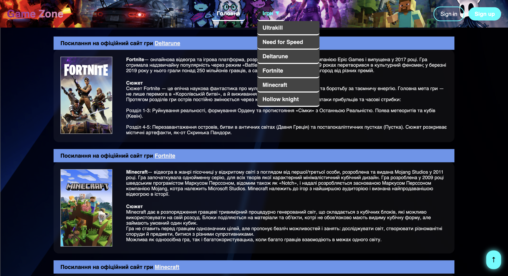
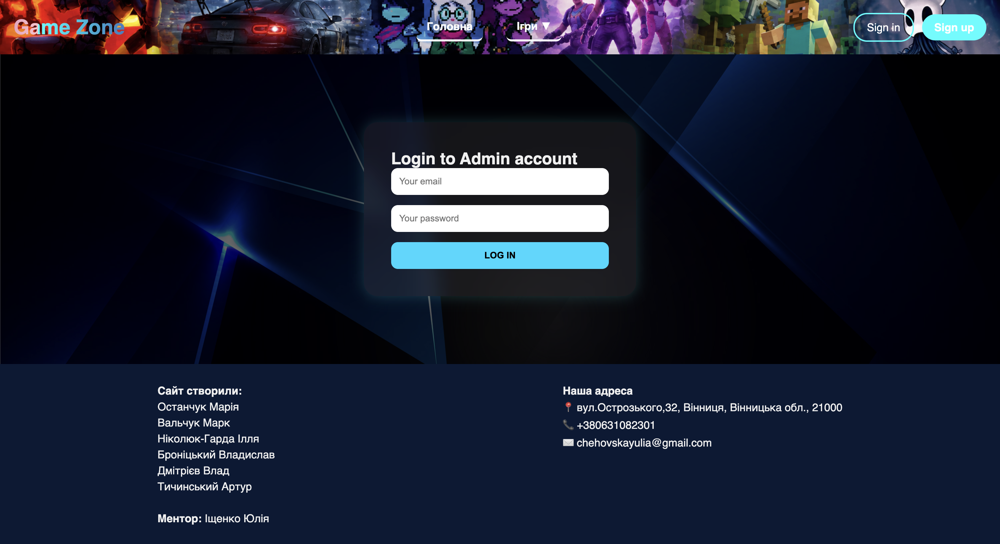
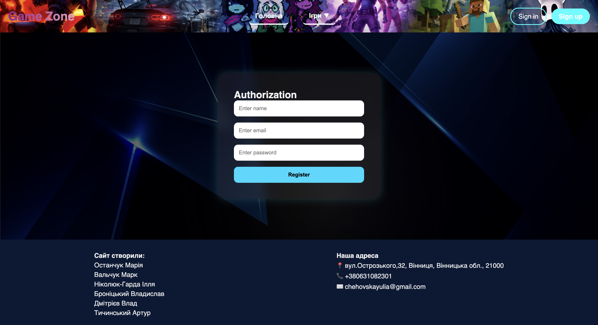

# 🎮 Game Zone

Game Zone is a web application built with **Python** and **Flask** that allows users to browse games, create an account, and securely log in.

The project demonstrates backend development with Flask, user authentication, database management using SQLite, and responsive web design.

---

## 📸 Screenshots

### Home page



### Login page



### Registration page



---

## ✨ Features

- User registration
- Secure user authentication
- Login and logout functionality
- Password hashing with Werkzeug
- SQLite database integration
- Responsive design
- Modern UI with CSS animations

---

## 🛠 Technologies

- Python
- Flask
- Flask-SQLAlchemy
- Flask-Login
- SQLite
- HTML5
- CSS3
- Jinja2
- Werkzeug

---

## 🚀 Installation

Clone the repository:

```bash
git clone https://github.com/Yulia72/Game_Zone.git
```

Go to the project folder:

```bash
cd Game_Zone
```

Install dependencies:

```bash
pip install -r requirements.txt
```

Run the application:

```bash
python main.py
```

Open your browser and visit:

```
http://127.0.0.1:5000
```

---

## 📂 Project Structure

```
GameZone/
│
├── main.py
├── requirements.txt
├── README.md
├── screenshots/
├── static/
├── templates/
└── instance/
```

---

## 📖 What I Learned

During this project I practiced:

- Building web applications with Flask
- Creating and managing databases with SQLAlchemy
- Implementing user authentication with Flask-Login
- Password hashing and secure authentication
- Working with HTML templates (Jinja2)
- Creating responsive layouts using CSS
- Using Git and GitHub for version control

---

## 📄 License

This project was created for educational and portfolio purposes.